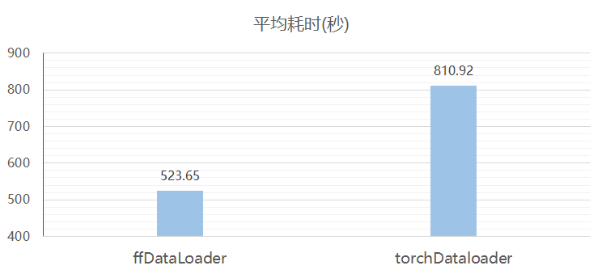

# FFRecord 转换指引

- [FFRecord 转换指引](#ffrecord-转换指引)
  - [**为什么要转换为 FFRecord ?**](#为什么要转换为-ffrecord-)
  - [**FFRecord 性能如何 ?**](#ffrecord-性能如何-)
  - [**FFRecord 转换规则**](#ffrecord-转换规则)
    - [**转换文件数量和大小**](#转换文件数量和大小)
    - [**转换方式参考**](#转换方式参考)
  - [**现有数据转换方法 -- dataset converter**](#现有数据转换方法----dataset-converter)
  - [**私有数据转换方法 -- general converter**](#私有数据转换方法----general-converter)
    - [dataset.py 转换所需要的函数定义](#datasetpy-转换所需要的函数定义)
  - [**MMDET3D 转换方法 -- mm converter**](#mmdet3d-转换方法----mm-converter)
    - [**第一步：转换原始数据为 FFRcord 格式**](#第一步转换原始数据为-ffrcord-格式)
    - [**第二步：Load FFRecord 数据**](#第二步load-ffrecord-数据)


## **为什么要转换为 FFRecord ?**
幻方 AI 自研了一套适合深度学习模型训练场景的文件读写系统 3FS，和一般的文件系统不同，3FS 文件系统有如下的一些特点：

- 大量打开、关闭小文件的开销比较大
- 支持高吞吐的随机批量读取

FFRecord 能够充分利用 3FS 文件系统的高效读取性能，其包括如下优势：
- 合并多个小文件，减少了训练时打开大量小文件的开销，对存储后端更加友好
- 支持随机批量读取，提升读取速度
- 包含数据校验，保证读取的数据完整可靠

## **FFRecord 性能如何 ?**
我们在 3FS 存储集群上进行了性能测试，以读取 ImageNet 数据集为例，比较如下两种数据读取方式的性能：
1. ffrecord + ffDataLoader的性能
2. 大量小文件 + PyTorch DataLoader 

为了模拟在分布式训练模型时的读取模式，我们使用 8 个互相独立的进程，每个进程拥有独立的 DataLoader，每个 DataLoader 使用 16 个子进程 (num_workers = 16)，batch size 设为 128，最终统计每个 DataLoader 读取 1000 个 batch 的时间并取平均。



从图中我们可以看到使用了 ffrecord + ffDataLoder 后速度能够得到明显的提升。

## **FFRecord 转换规则**
### **转换文件数量和大小**
为满足最佳性能，FFRecord 的转换需要满足如下两个要求：
1. 每个文件不小于 256MB （512 x 512KB）
2. 满足条件1的情况下，文件数量尽可能大于100，小于200

### **转换方式参考**
FFRecord 中的数据通过二进制格式进行存储，有如下两种将图片数据转换为二进制数据的方法：

方法 1：通过 pickle 转换为二进制
```
image = Image.open(fname)
data = pickle.dumps(image)
```

方法 2：使用二进制格式读取文件
```
with open(img_file, "rb") as fp:
    img_bytes = fp.read()
```

两种方法的性能性能对比：

- 速度对比：方法 1 (pickle) 比方法 2 (二进制文件) 读取速度更快
    - 方法 1 读取速度大约为 10 GB/s，方法 2 读取速度大约为 1GB/s
- 存储大小对比：方法 2 (二进制文件) 转换后文件体积更小
    - 方法 1 的存储体积约为方法 2 的 5 倍


## **现有数据转换方法 -- dataset converter**

如果需要转换的数据格式与 HFai 支持的数据格式**相同**，则可以直接使用 HFai 转换完的数据。

如果需要转换的数据格式与 HFai 支持的数据格式**类似**，则可以下载现有的转换脚本，进行简单修改后转换。

目前 HFai 已经支持的数据列表请参考 [stutio dataset](http://studio.yinghuo.high-flyer.cn/#/datasets) 界面。


## **私有数据转换方法 -- general converter**

如果需要转换的数据格式与 HFai 支持的数据格式**区别较大**
，则可以使用通用数据集转换脚本进行转换，通用数据转换脚本使用方法如下：
```
python general_converter.py {dataset.py} {input_dir} {cvt_name}
```

- `dataset.py`：需要转换的数据集代码，代码文件中包括 `torch.utils.data.Dataset` 类型的类定义和转换所需要的函数
- `input_dir`：原始数据路径
- `cvt_name`：转换后 FFRecord 数据目录

### dataset.py 转换所需要的函数定义

`dataset.py` 中除了包括一个 `torch.utils.data.Dataset` 类型的类定义，还需要包括三个额外的函数：

**函数 1：get_datasets(data_dir)**（一定要提供） 
- 输入：原始数据路径
- 输出：数据元组的列表，每一个数据元组格式为：(数据对象，split)
- 目的：通过该函数获得数据集的数据对象和拆分名称（例如 `train` 和 `val`)，General Converter 会将数据集自动打包
- 函数定义位置：`dataset.py` 中的非类函数

**函数 2：get_files_or_dirs()** （可选）
- 输入：无
- 输出：需要拷贝的文件或者目录列表，路经为相对原始数据目录的路径
- 目的：通过该函数获得需要拷贝的路径，General Converter 将以相同的相对路径拷贝到 FFRecord 目录
- 函数定义位置：`dataset.py` 中的非类函数

**函数 3：get_meta()**（可选）
- 输入：无
- 输出：数据集的 meta 信息，输出应该为 pickle 可以 dump 的格式，例如 dict
- 目的：通过该函数获得数据集的 meta 数据，General Converter 会将返回的元数据保存为 `meta.pkl`
- 函数定义位置：`torch.utils.data.Dataset` 的类函数

示例参考 [imagenet_dataset.py](general_converter/imagenet_dataset.py) 或者 [coco_dataset.py](general_converter/coco_dataset.py)

## **MMDET3D 转换方法 -- mm converter**
mm converter 中目前支持了 mmdet3d 的数据自动转换为 FFRecord。转换过程包括两个步骤，第一步是将原始数据自动转换为 FFRecord 数据格式，第二步是通过修改配置来在训练过程中载入 FFRecord 数据。

### **第一步：转换原始数据为 FFRcord 格式**
脚本会将 mmdet3d 所需要的图像或者点云数据，通过 bytes 的数据格式，保存为FFRecord文件。
```
git clone ssh://git@gitlab.high-flyer.cn:10022/xiao.bi/mmconverter.git
cd mmconverter
python mmdet3dconverter.py [config_file] [out_dir] [dump_key]
```
- config_file 为训练时使用的 mmdet3d config 文件
- out_dir 为 FFRecord 处理后数据的输出目录
- dump_key 默认为 img_filename，还可以指定为 pts_filename


### **第二步：Load FFRecord 数据**

1. 将 mmconverter 中的 ffrecord_loading.py 加入项目文件，进行 import
2. 在config的数据pipeline中，修改 pipeline 类型
    - 如果数据Load type是LoadMultiViewImageFromFiles：
        - 将LoadMultiViewImageFromFiles换成LoadMultiViewImageFromFilesHF
    - 如果数据 Load type 是其他的数据类型：
        - 无需更改
3. 修改 pipeline 的 file_client_args 参数为如下所示：
```
file_client_args=dict(
    backend='ffrecord', # 修改为 ffrecord 对应后端
    fname=ffr_root + 'train' # 指定 ffrecord 数据目录
)
```

完成上述两个步骤后即可使用 FFRecord 数据进行训练，以 BEVFormer 训练为例，采用 10 节点，每个节点 8 台 GPU，每个 GPU 的 batch size 为 1 进行训练时间测试。

<!-- |  BEVFORMER | 数据读取+处理耗时| 单Iter耗时| 训练总耗时 |
|  ----  | ----  | --- | --- |
|原始数据|	50th iter: 2.63s<br>others: 0.219s	|50th iter: 4.618<br>others: 2.267|	6.46h|
|FFRecord<br>单条 sample 多摄像头分开读| 50th iter: 2.279<br>others: 0.16| 50th iter: 4.159<br>others: 2.00| 5.3h|
|FFRecord<br>单条 sample 多摄像头同时读|50th iter: 2.22<br>others: 0.15	|50th iter: 4.06<br>others: 1.98	|5.2h| -->

|  BEVFORMER | 训练总耗时 |
|  ----   | --- |
|原始数据|	6.46h|
|FFRecord<br>单条 sample 多摄像头分开读| 5.3h|
|FFRecord<br>单条 sample 多摄像头同时读|5.2h|
